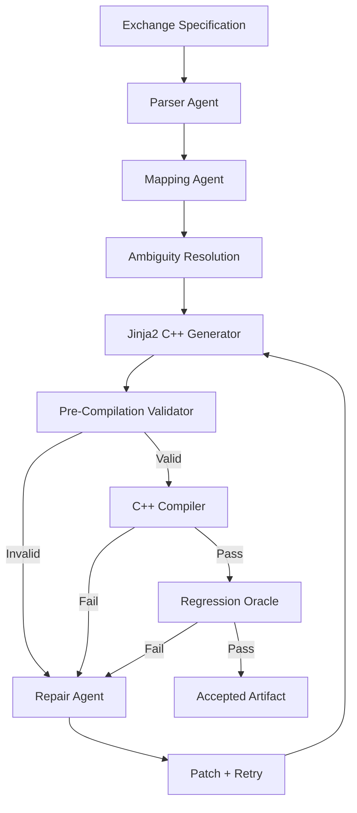

# Claude SDK Agentic Pipeline for C++ Code Generation

An educational/portfolio implementation of an agentic pipeline that converts structured exchange specifications into deterministic C++ normalization-manager code.

> **Portfolio note:** This repository uses synthetic, exchange-like specifications. It does not contain proprietary code, schemas, data, or internal implementation from any employer.

## Architecture



## What this project demonstrates

- Claude SDK / Anthropic Messages API integration
- Agentic decomposition of a code-generation problem
- Structured JSON outputs from LLM agents
- Protocol-field mapping and ambiguity resolution
- Deterministic C++ generation with Jinja2
- Structural/type contract validation before compilation
- Automated compile/test feedback
- Regression-oracle based acceptance/rejection
- Bounded autonomous repair loop
- Offline mode for reproducible demos and tests

## Repository structure

```text
claude-cpp-agent-pipeline/
├── app.py
├── requirements.txt
├── .env.example
├── .gitignore
├── README.md
├── config/
│   └── pipeline.yaml
├── specs/
│   └── sample_exchange.yaml
├── templates/
│   └── normalization_manager.cpp.j2
├── src/
│   ├── __init__.py
│   ├── agents.py
│   ├── generator.py
│   ├── validator.py
│   ├── oracle.py
│   └── pipeline.py
└── tests/
    ├── test_generator.py
    └── test_validator.py
```

## Setup

Python 3.10+ is recommended.

```bash
git clone https://github.com/<YOUR_USERNAME>/claude-cpp-agent-pipeline.git
cd claude-cpp-agent-pipeline

python -m venv .venv

# Windows
.venv\Scripts\activate

# macOS/Linux
source .venv/bin/activate

pip install -r requirements.txt
```

Optional Claude API setup:

```bash
copy .env.example .env
```

Then add your Anthropic API key:

```text
ANTHROPIC_API_KEY=your_key_here
CLAUDE_MODEL=your_current_claude_model
```

The code reads the model name from the environment so the repository does not depend on a hard-coded model version.

## Run the offline demo

The offline mode is useful for GitHub reviewers and interviews because it does not require an API key:

```bash
python app.py --spec specs/sample_exchange.yaml --offline
```

It will:

1. Parse the synthetic specification
2. Map exchange fields to an internal model
3. Generate C++ with Jinja2
4. Validate the generated structure
5. Compile the C++ if a compiler is available
6. Run the regression oracle
7. Produce an artifact under `artifacts/`

## Run with Claude

```bash
python app.py --spec specs/sample_exchange.yaml
```

The Claude-powered pipeline uses separate agent roles for:

- specification parsing
- field mapping
- ambiguity resolution
- repair suggestions

The final C++ file is still generated deterministically from a Jinja2 template rather than asking the LLM to freely write the complete source file.

## Run tests

```bash
pytest -q
```

## Design decision: why LLM + deterministic generation?

LLMs are useful for interpreting natural-language specifications and resolving ambiguous mappings, but unrestricted source-code generation can be difficult to reproduce and validate.

This project therefore separates:

```text
AI reasoning
    ↓
Structured intermediate representation
    ↓
Deterministic template generation
    ↓
Validation + compilation
```

That separation makes the generated C++ easier to review, test, and reproduce.

## Interview explanation

> I designed an agentic pipeline where Claude interprets a synthetic exchange specification and produces a structured mapping. The mapping is then passed to a deterministic Jinja2 generator that creates C++ normalization-manager code. Before compilation, a validator checks required classes, methods, fields, and types. Compilation and regression results act as feedback to a bounded repair loop, preventing unstable patches from being accepted.

## Limitations

This is a portfolio-scale implementation rather than a production trading system. It intentionally uses synthetic specifications and a small C++ model. A production implementation would require stronger schema validation, compiler/AST analysis, sandboxed builds, extensive exchange-specific test suites, observability, access control, and security review.
